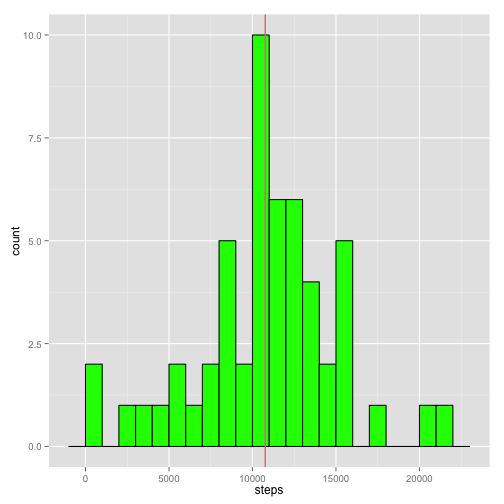
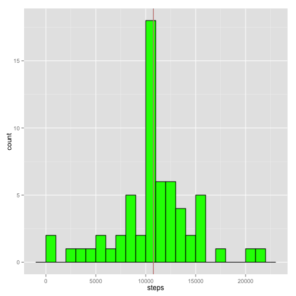

# Reproducible Research: Peer Assessment 1


## Loading and preprocessing the data


```r
if(!file.exists("activity.zip")) {
  download.file("https://d396qusza40orc.cloudfront.net/repdata%2Fdata%2Factivity.zip", destfile="activity.zip", method="curl")
}
unzip("activity.zip")
activity <- read.csv("activity.csv", header = T)
activity$date <- as.Date(activity$date)
complete_activity <- na.omit(activity)
```

## What is mean total number of steps taken per day?


```r
daily_steps <- with(complete_activity, aggregate(steps, list(date), sum))
names(daily_steps) <- c("date", "steps")
mean_steps <- mean(daily_steps$steps)
median_steps <- median(daily_steps$steps)

library(ggplot2)
ggplot(daily_steps, aes(x=steps)) + 
  geom_histogram(binwidth=1000, colour="black", fill="green") + 
  geom_vline(aes(xintercept=mean_steps, colour="orange")) + 
  geom_vline(aes(xintercept=median_steps, colour="blue"))
```

 

## What is the average daily activity pattern?


```r
interval_steps <- with(complete_activity, aggregate(steps, list(interval), mean))
names(interval_steps) <- c("interval", "steps")
ggplot(interval_steps, aes(x=interval, y=steps)) +
  geom_line()
```

 

```r
with(interval_steps, interval[which.max(steps)])
```

```
## [1] 835
```

## Imputing missing values


```r
na_count <- length(activity$steps) - length(complete_activity$steps)

#merge using mean for 5-minute interval
estimated_activity <- merge(activity, interval_steps, by="interval")
estimated_activity$steps <- with(estimated_activity,
                                 ifelse(is.na(steps.x), steps.y, steps.x))
estimated_activity <- estimated_activity[,names(activity)]

merged_daily_steps <- with(estimated_activity, aggregate(steps, list(date), sum))
names(merged_daily_steps) <- c("date", "steps")
merged_mean <- mean(merged_daily_steps$steps)
merged_median <- median(merged_daily_steps$steps)

ggplot(merged_daily_steps, aes(x=steps)) + 
  geom_histogram(binwidth=1000, colour="black", fill="green") + 
  geom_vline(aes(xintercept=merged_mean, colour="orange")) + 
  geom_vline(aes(xintercept=merged_median, colour="blue"))
```

 

Mean and median have not changed very much, inputing missing data didn't affect the estimates because missing days were added to the central break.

## Are there differences in activity patterns between weekdays and weekends?


```r
estimated_activity$day <- factor(ifelse(weekdays(estimated_activity$date) %in% c("Saturday", "Sunday"), "weekend", "weekday"))

weekly_activity <- with(estimated_activity, aggregate(steps, list(interval, day), mean))
names(weekly_activity) <- c("interval", "day", "steps")

ggplot(weekly_activity, aes(x=interval,y=steps)) +
  facet_grid(day~.) +
  geom_line()
```

 

Weekday and weekend activities differ from each other. Weekdays have a large spike in the morning and less activity the rest of the day. Weekends have activity spread throughout the whole day.
