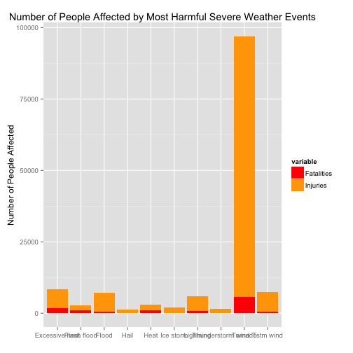
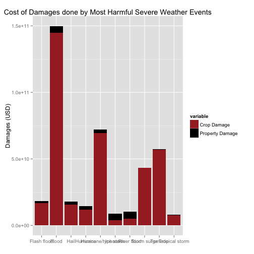

Severe Weather Events Damage Analysis Report
============================================

## Synopsis

The following report retrieves data from the NOAA Storm Database and completes an analysis on the data to determine the  impact of these events on population health as well as economic consequences.

The result of examining the impact of these events on population health was that tornadoes are by far the most danergous events. On the other hand, the result of examining the impact of these events in terms of economic consequences reveals that floods are the most costly events.

## Data Processing

### Libraries


```r
library(ggplot2)
library(reshape2)
library(R.utils)
```

```
## Loading required package: R.oo
## Loading required package: R.methodsS3
## R.methodsS3 v1.6.1 (2014-01-04) successfully loaded. See ?R.methodsS3 for help.
## R.oo v1.18.0 (2014-02-22) successfully loaded. See ?R.oo for help.
## 
## Attaching package: 'R.oo'
## 
## The following objects are masked from 'package:methods':
## 
##     getClasses, getMethods
## 
## The following objects are masked from 'package:base':
## 
##     attach, detach, gc, load, save
## 
## R.utils v1.32.4 (2014-05-14) successfully loaded. See ?R.utils for help.
## 
## Attaching package: 'R.utils'
## 
## The following object is masked from 'package:utils':
## 
##     timestamp
## 
## The following objects are masked from 'package:base':
## 
##     cat, commandArgs, getOption, inherits, isOpen, parse, warnings
```

```r
library(car)
```

### Retrieving Data


```r
download.file(url="https://d396qusza40orc.cloudfront.net/repdata%2Fdata%2FStormData.csv.bz2", destfile="StormData.csv.bz2", method="curl")
bz <- bzfile("StormData.csv.bz2", "r")
```

### Loading Data and Adjusting Case


```r
data <- read.csv(bz, header=T)
close(bz)

#consistent and easier to read
names(data) <- tolower(names(data))
data$evtype <- capitalize(tolower(data$evtype))
```

### Calculating Health Damages


```r
#sum up injuries and fatalities by event type
casualties <- aggregate(cbind(fatalities, injuries) ~ evtype, data, sum)
names(casualties) <- c("Event", "Fatalities", "Injuries")
#remove events with no injuries or fatalities
casualties <- casualties[(casualties[,2] > 0 & casualties[,3] > 0),]
#sort and take top ten fatality events
casualties <- casualties[order(casualties[,3], decreasing=T),]
casualties <- casualties[1:10,]
casualties <- melt(casualties, "Event")
```

### Calculating Economic Damages


```r
#recode the exponent as a multiplier
data$propdmgexp <- as.numeric(Recode(data$propdmgexp, 
    "'0'=1;'1'=10;'2'=100;'3'=1000;'4'=10000;'5'=100000;'6'=1000000;'7'=10000000;'8'=100000000;'B'=1000000000;'h'=100;'H'=100;'K'=1000;'m'=1000000;'M'=1000000;'-'=0;'?'=0;'+'=0", 
    as.factor.result = FALSE))
data$cropdmgexp <- as.numeric(Recode(data$cropdmgexp, 
    "'0'=1;'2'=100;'B'=1000000000;'k'=1000;'K'=1000;'m'=1000000;'M'=1000000;''=0;'?'=0", 
    as.factor.result = FALSE))
#calculate damages
data$propdmg <- data$propdmg * data$propdmgexp
data$cropdmg <- data$cropdmg * data$cropdmgexp
#sum up total damages by event type
damages <- aggregate(cbind(propdmg, cropdmg) ~ evtype, data, sum)
names(damages) <- c("Event", "Property", "Crop")
#sort and take top ten costly events
damages <- damages[order((damages[,2] + damages[,3]), decreasing=T),]
damages <- damages[1:10,]
damages <- melt(damages, "Event")
```

## Results

### Plotting Health Damages


```r
ggplot(casualties, aes(x=Event, y=value, fill=variable)) +
  geom_bar(stat="identity") +
  labs(x = "", y = "Number of People Affected") +
  scale_fill_manual(values = c("red", "orange"), labels = c("Fatalities", "Injuries")) +
  ggtitle("Number of People Affected by Most Harmful Severe Weather Events")
```

 

### Plotting Economic Damages


```r
ggplot(damages, aes(x=Event, y=value, fill=variable)) +
  geom_bar(stat="identity") +
  labs(x="", y="Damages (USD)") +
  scale_fill_manual(values=c("brown", "black"), labels=c("Crop Damage", "Property Damage")) +
  ggtitle("Cost of Damages done by Most Harmful Severe Weather Events")
```

 


